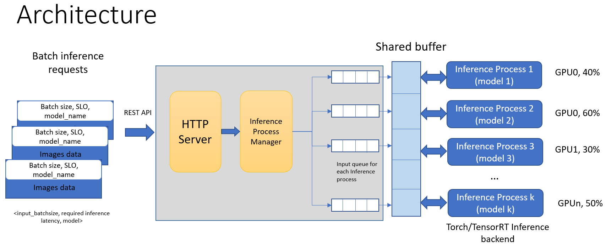

# efficient-serving-system
## Efficient Deep Learning multi-model scheduling and serving for multi-GPU system with resources provisioning

Sharing multiple inference processes of DL models on a GPU
usually leads to unpredictable inference time of each model inference. The purpose of this project is to schedule the models inference processes on a multi-GPU system based 
on client requests and provision a GPU thread limit for each process so that the inference process of each model has least interference with each other. 

This work leverages NVIDIA MPS: https://docs.nvidia.com/deploy/mps/index.html. MPS supports limited execution resource provisioning, 
or in the other words, the client contexts can be set to only use a portion of the available threads. The experiments show that, with proper provisioning settings for each model 
on a GPU, the execution of each model doesn't interfere with the others when co-running.

This project uses Crow(https://github.com/CrowCpp/Crow) for creating the HTTP web services to handle client requests. 

And implement 2 types of Inference for DL models: Libtorch C++ API: (https://pytorch.org/cppdocs/) and NVIDIA TensorRT C++ Inference (https://docs.nvidia.com/deeplearning/tensorrt/developer-guide/index.html#c_topics)


## Installation
### Get easy with Docker container:
  Require install docker NVIDIA toolkit in advanced: https://docs.nvidia.com/datacenter/cloud-native/container-toolkit/install-guide.html
  
  Build container:
  
  ``` docker build -t ef-serving . ```
  
  Then run the container in interactive mode with:
  
  ``` sudo docker run --gpus all --shm-size 1G -p 8082:8082 -it ef-serving /bin/bash```
 
### OR Install on host machine:
  Refer to InstallGuide.
  
### Build the project:
  Go to /app folder on docker container or Project folder on host machine. Then:
  ```
  mkdir build && cd build
  cmake ..
  cmake --build .
  ```
### Provide models
  The system needs Torchscript ```.pt``` models for Torch C++, and ONNX ```.onnx``` models for TensorRT.
  Refer to convert.py in ```model_dir``` for example of converting torchvision models to the Torchscript and ONNX format.

  Copy the converted models to ```model_dir``` and then append ```model_name,converted_model_file``` to ```config_tcpp.txt``` or ```config_trt.txt```.

### Profile models:
  When adding a model to the system, need an offline profiling step to determine the inference time of the model with pairs of ```input_batchsize,GPU% provisioned```.
  
  Go to ```profiled_data``` Then:
  ```
  mkdir build && cd build
  cmake ..
  cmake --build .
  ./main        # Run the offline profiler 
  ```
  The profiling results stored in ```tcpp_profiler.txt``` and ```trt_profiler.txt```

### Run and Test:
  Run MPS Server:
  ``` ../start_MPS.sh```
  
  Run Server:
  ``` ./server tcpp``` for Torch C++ Inference or ```./server trt``` for TensorRT Inference
  
  Test client:
  ``` python client.py``` or ```python async_client.py```
